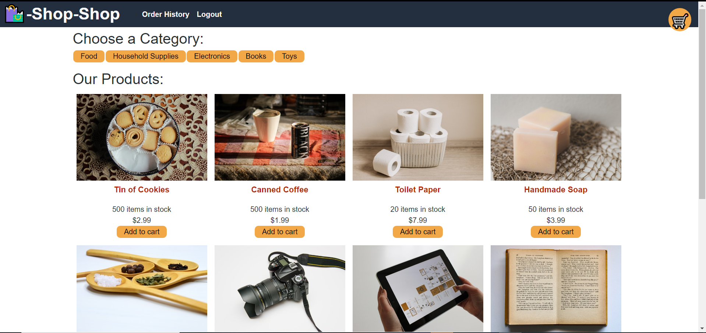
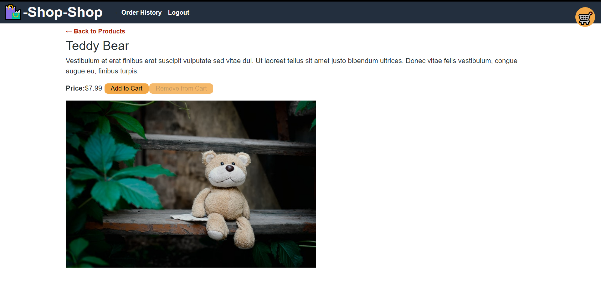

# Redux store: Shop-Shop

## Project Description

This single page MERN Shop app is an e-commerce website where users can create an account, filter through products through categories, place products in their cart and buy them. This application also uses front-end routing, api requests (queries and mutations) and user authentication.

## Technologies Used

JavaScript
MERN (MongoDB, Mongoose, Expressjs, REACT, Nodejs)
GraphQL
Apollo
JsonWebToken
Heroku

## Screenshots

## License

GNU GENERAL PUBLIC LICENSE

## Installation Process

1. Clone the repository into your CLI.

2. Ensure that the repo includes a package.json with the required dependencies. You can create one by running npm init in your CLI, and then run npm install to install the dependencies.

3. Run npm run develop in your terminal from the root directory to launch the application. Or check the deployed app directly on the app's heroku link 

